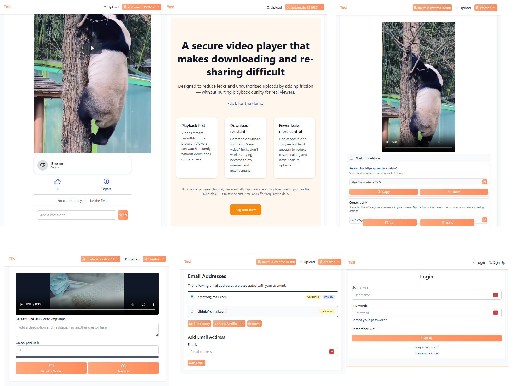

# Screenshots



# Local setup

## Set up https certs

You need this to be able to run crypto in javascript

1. Install mkcert and generate certificates

``` 
sudo apt install mkcert
mkcert -install
mkcert protectapp.loc
```

This creates:

- protectapp.loc.pem
- protectapp.loc-key.pem

2. Move to the folder

```
mv protectapp.loc.pem docker/nginx/local_certs/protectapp.crt
mv protectapp.loc-key.pem docker/nginx/local_certs/protectapp.key
```

3. Rebuild/start docker

## Start docker

1. Copy env files in root directory and ./docker directory
2. Build docker

``` 
cd docker
docker compose up -d --build
```

# Deployment

Run `./deploy.sh --build` to build docker or `./deploy.sh` to deplo without building docker

# Video

## Shards explanation

```
[
    {
        "mask": "c5",
        "nonce": "bca6b29d09e65d3f5b8b9182",
        "shard": "92e1ba1b_01be0_4141197_9322_4ec906315838.dar.io",
        "storage_metadata": {
            "file_id": "4_z71e7840230a2b6749fab0116_f100456c2d054bc8a_d20251129_m155318_c005_v0501023_t0026_u01764431598328",
            "bucket_id": "71e7840230a2b6749fab0116",
            "file_path": "video/media/2/shards/52/92e1ba1b_01be0_4141197_9322_4ec906315838.dar.io",
            "bucket_name": "nothing-special-bucket"
        }
    }
]
```

- mask - hex value of a byte (in this case number 197)
- nonce - random string, as is
- shard - name. When split by "_" you get chunks
    - chunk[1] - 01be0. That is shard index, since shards represent a video we need to know shard order so we can
      display a video. Remove first 4 characters and you are left with 0 (which is index).
    - chunk[2] - 4141197. This is mask. Remove first 4 chars and you get 197 (which is mask). Use that for XOR
- storage_metadata - is just metadata from Backblaze

Expose only **nonce**, **shard**, **storage_metadata.file_path**.

## Video theme

https://www.mux.com/blog/the-new-video-js-themes